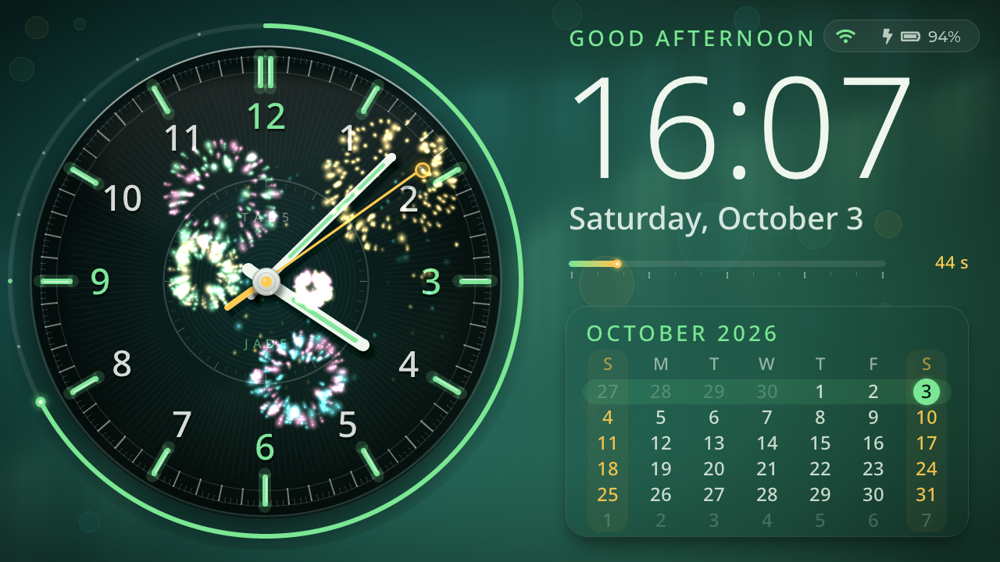

# Fancy Clock for M5Stack Tab5

LVGL 9.5 + M5GFX/M5Unified, 1280x720 landscape.

Requires: Arduino CLI, the `m5stack:esp32` core (3.3.x), and the libraries `lvgl` (9.5), `M5GFX`, `M5Unified`.

- Analog dial with sweeping second hand, day-progress ring, glass calendar card, big digital time, seconds bar, battery.
- Touch controls (all remembered across reboots except display on/off):
  - **Drag left/right** anywhere → brightness (right = brighter). A small bar shows the level; minimum ~3% so the screen can't be lost.
  - **Double-tap** → display off (backlight 0; all drawing and automatic WiFi syncs paused, only touch + serial stay
    active; the clock keeps time). While off, any tap wakes it - the picture is refreshed *before* the backlight
    comes on, so the second hand doesn't jump. (Panel sleep and CPU down-clocking were tried and don't work on the
    Tab5: panel sleep also disables touch, and 40 MHz starves the MIPI-DSI controller. See comments in the code.)
  - **Tap the big digits** → 12h/24h. **Tap the WiFi icon** (top right) → WiFi setup. **Tap anywhere else** → next theme
    (Aurora, Sunset, Ocean, Graphite). Single taps act after a ~0.35 s pause so they can't be confused with a double-tap.
- Static artwork is rendered once (32-bit, dithered to RGB565) into an image; only the hands/text are redrawn per frame.

## Build / flash
    tools/build.sh            # compile
    tools/build.sh upload     # compile + flash /dev/ttyACM0

Board options are set in `tools/build.sh`. `ChipVariant=prev3` is for ESP32-P4 silicon older than v3.00
(esptool prints `revision v1.x`); use `postv3` for newer units. `lv_conf.h` lives next to the sketch.

## Time
Three sources, best first:
1. **Network time (NTP)** - set up WiFi by tapping the WiFi icon in the top-right corner (scan, pick a network,
   type the password). The clock then connects in the background (core 0), syncs over SNTP, and shuts the radio
   down completely (the ESP-Hosted link to the C6 too, which also frees ~60 KB of internal RAM). It repeats every
   6 hours; after a failed attempt it backs off (1, 2, 5, 10, 30, 60 min). The WiFi icon lights up while the
   time is NTP-synced. Daylight saving is automatic because the timezone is a POSIX TZ string.
2. **RTC** - every NTP sync also writes the Tab5's RX8130 (on a whole-second boundary), so an offline reboot
   still starts within milliseconds. Without NTP for 24 h the clock falls back to the RTC.
3. **Build time** - the RTC is seeded from the build time when new firmware boots.

    tools/clockctl.py scan                     # list WiFi networks (checks the radio works)
    tools/clockctl.py wifi "SSID" "PASSWORD"   # store credentials in flash and sync now
    tools/clockctl.py tz "PST8PDT,M3.2.0,M11.1.0"   # default US Pacific; other examples below
    tools/clockctl.py sync                     # sync now
    tools/clockctl.py time                     # set the RTC from this computer (offline use)

POSIX TZ examples: `EST5EDT,M3.2.0,M11.1.0` (US Eastern), `GMT0BST,M3.5.0/1,M10.5.0` (UK),
`CET-1CEST,M3.5.0,M10.5.0/3` (Central Europe), `CST-8` (China), `JST-9` (Japan), `UTC0`.

## Other helpers
    tools/clockctl.py shot out.png   # screenshot over USB serial
    tools/clockctl.py cmd S|C|M      # status+timing stats / next theme / toggle 12-24h
    tools/clockctl.py cmd K          # stress test: 20 automatic theme switches
    tools/clockctl.py cmd H<mask>    # debug: 1=hide day arc 2=hand shadows 4=tip glow 8=hub shadow
    tools/clockctl.py log 5          # device log
    tools/make_fonts.sh              # regenerate fonts.h (Noto Sans subset, OFL)

`ROTATION` (1 or 3) and `BRIGHTNESS` are constants at the top of `fancy_clock.ino`.

## Credits
- [LVGL](https://lvgl.io) (MIT), [M5GFX / M5Unified](https://github.com/m5stack) (MIT), Arduino-ESP32 / ESP-Hosted (Apache-2.0).
- `fonts.h` embeds a subset of [Noto Sans](https://fonts.google.com/noto) Light and Medium, licensed under the
  SIL Open Font License 1.1.
- No license has been chosen for this project's own code yet.
